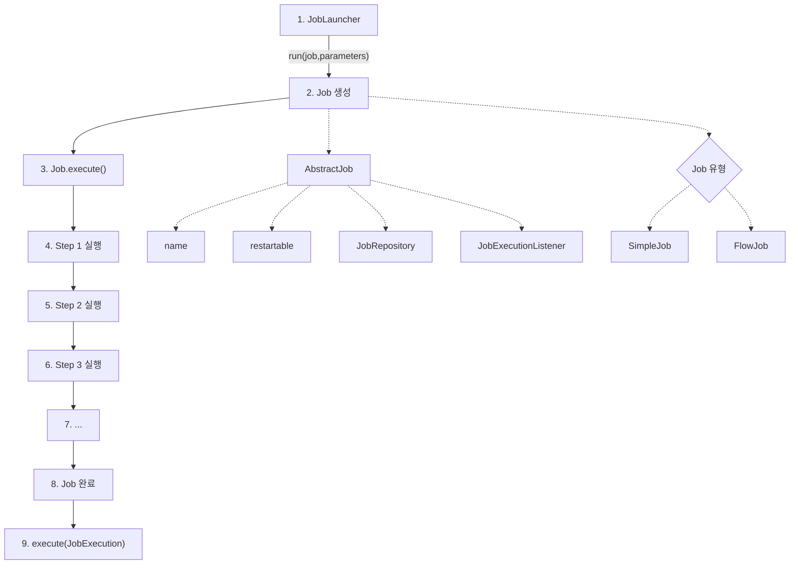

# 배치 도메인 이해

## Job

- 잡은 배치에서 가장 최상위에 있는 개념이다. ( 하나의 처리 작업 전체를 의미한다. )
- 잡은 크게 Simple, Flow로 나누어지게 된다. (Flow 추후에 설명)

### 전체적인 흐름
1. JobLauncher가 실행을 시작합니다. job과 parameters를 받아 run(job, parameters) 메소드를 호출
2. Job 객체가 생성됩니다. 이 Job은 여러 Step으로 구성
3. Job의 execute() 메소드가 호출되어 실제 작업이 시작
4. Job 내부의 Step 1 + .... 이 실행됩니다. 
5. 마지막으로 execute(JobExecution) 메소드가 호출되어 작업 결과를 처리 

