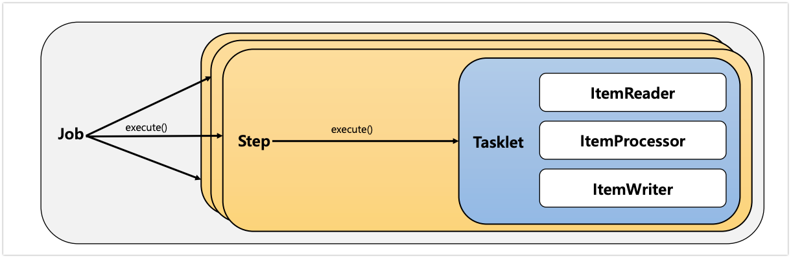

# 배치 도메인 이해

## Job

- 잡은 배치에서 가장 최상위에 있는 개념이다. ( 하나의 처리 작업 전체를 의미한다. )
- 잡은 크게 Simple, Flow로 나누어지게 된다. (Flow 추후에 설명)


### 전체적인 흐름
1. JobLauncher가 실행을 시작합니다. job과 parameters를 받아 run(job, parameters) 메소드를 호출
2. Job 객체가 생성됩니다. 이 Job은 여러 Step으로 구성
3. Job의 execute() 메소드가 호출되어 실제 작업이 시작
4. Job 내부의 Step 1 + .... 이 실행됩니다. 
5. 마지막으로 execute(JobExecution) 메소드가 호출되어 작업 결과를 처리 


### SimpleJob 생성
```java
@Configuration
@RequiredArgsConstructor
public class SimpleJob {
    private static final Logger logger = LoggerFactory.getLogger(SimpleJob.class);

    private final JobRepository jobRepository;
    private final PlatformTransactionManager transactionManager;


    @Bean
    public Job simpleJob_1() throws Exception {
        return new JobBuilder("batchJob", jobRepository)
                .incrementer(new RunIdIncrementer())
                .start(simpleStep_1())
                .build();
    }

    @Bean
    Step simpleStep_1() {
        return new StepBuilder("step1", jobRepository)
                .tasklet((contribution, chunkContext) -> {
                    logger.info("step1 was excuted!");
                    return RepeatStatus.FINISHED;
                }, transactionManager)
                .build();
    }
}
```

```
2024-10-15 22:21:09 [INFO ] [] [] Job: [SimpleJob: [name=batchJob]] launched with the following parameters: [{'run.id':'{value=4, type=class java.lang.Long, identifying=true}'}]
2024-10-15 22:21:09 [INFO ] [] [] Executing step: [step1]
2024-10-15 22:21:09 [INFO ] [] [] step1 was excuted!
2024-10-15 22:21:09 [INFO ] [] [] Step: [step1] executed in 36ms
2024-10-15 22:21:09 [INFO ] [] [] Job: [SimpleJob: [name=batchJob]] completed with the following parameters: [{'run.id':'{value=4, type=class java.lang.Long, identifying=true}'}] and the following status: [COMPLETED] in 94ms
```

- 해당 로그를 통해서 PARAM을 받은 뒤에 Job이 실행되고 Job에 step이 실행되어 로그가 찍히고 execute를 통해서 데이터가 들어간 것을 확인할 수 있다.


## JobInstance

- 잡 인스턴스는 간단하게 new()의 인스턴스와 같다고 생각하면 된다. 
- new를 통해 인스턴스를 2개를 만들면 같은 형태이지만 완벽하게 같지는 않다. Job Instance 또한 마찬가지이다.
- 만약에 정산을 처리하는 Job이 있다고 생각하자 하나의 Job에서 매일 동작하지만 Param으로 날짜를 받으면 결국 다른 의미를 가지게 된다.

> 처음 Job + JobParameter를 가지게 되면 새로운 JobInstance 생성 , 이전에 실행을 한 경우 존재하는 JobInstance를 반환한다.

```java
@Slf4j
@Configuration
@RequiredArgsConstructor
public class JobInstance {

    private final JobRepository jobRepository;
    private final PlatformTransactionManager transactionManager;

    @Bean
    public Job simpleJob2() throws Exception {
        return new JobBuilder("simpleJob2", jobRepository)
                .start(simpleStep2())
                .build();
    }

    @Bean
    Step simpleStep2() {
        return new StepBuilder("simpleStep2", jobRepository)
                .tasklet((contribution, chunkContext) -> {
                    log.info("step1 was excuted!");
                    return RepeatStatus.FINISHED;
                }, transactionManager)
                .build();
    }
}
```
- 해당 코드는 위에 동일한 코드이다. 하지만 처음이라고 생각하고 생각해보자
- 우리는 위에 execute()를 통해서 정보를 저장한다고 했다. 이것은 DB에 Batch의 실행 정보를 저장한다.

- 똑같은 Job을 2번 실행을 하면 2번 로그가 찍히지 않는다.
- `select * from BATCH_JOB_INSTANCE;`을 통해서 정보를 살펴보면 Job의 정보가 있는데 JobKey는 Param을 통해 암호화를 통해서 처리한 것이다.
- 즉. `Job name + parameter가 같다면 이전에 동일한 잡을 반환한다.` 
```json
[
        {
        "JOB_INSTANCE_ID": 1,
        "VERSION": 0,
        "JOB_NAME": "simpleJob2",
        "JOB_KEY": "d41d8cd98f00b204e9800998ecf8427e"
        }
]
```

### [ 동일한 잡을 2번 수행할 수 없나? ]
- Spring Batch4에서는 자동으로 Id가 달라지는 옵션이 설정이 되어서 따로 처리할 필요가 없었다.
- 하지만 Batch5에서는 엄격해졌기 때문에 다음과 같은 변화를 통해서 처리가 가능하다.
```java
        return new JobBuilder("batchJob", jobRepository)
                .incrementer(new RunIdIncrementer())
```
- RunIdIncrementer를 통해서 ID를 증가시켜 같은 JobInstance가 아니게 만들어 동일한 잡을 여러번 처리가 가능하게 할 수 있다.


## JobParameter

- Job을 실행할 때 함께 포함되어 사용되는 파라미터를 의미한다.
- 이때 JobParameter는 JobInstance와 1:1관계를 가지게 된다.

### Parameter 주입하는 방법

1. 애플리케이션 실행 시 주입
```java
java -jar Batch.jar requestDate=20241010
```

2. 코드를 통해서 생성
```java
JobParameterBuilder, DefaultJobParametersConverter
```

3. SpEL 이용
- @JobScope, @StepScope 선언이 필수이다.
```java
@Value("#{jobParameter[requestDate]}") 
```

```java
@Component
@RequiredArgsConstructor
public class JobParameterApplicationRunner implements ApplicationRunner {

    private final JobLauncher jobLauncher;
    private final Job jobParameterTest;

    @Override
    public void run(ApplicationArguments args) throws Exception {
        JobParameters jobParameters = new JobParametersBuilder()
                .addString("param1", "value1")
                .addString("param2", "123")
                .addDate("param3", new Date())
                .toJobParameters();

        jobLauncher.run(jobParameterTest, jobParameters);
    }

}

@Slf4j
@Configuration
@RequiredArgsConstructor
public class JobParameter {
    private final JobRepository jobRepository;
    private final PlatformTransactionManager transactionManager;
    private final JobLauncher jobLauncher;

    @Bean
    public Job jobParameterTest() throws Exception {
        return new JobBuilder("jobParameterTest", jobRepository)
                .start(simpleStepJobParameterTest())
                .build();
    }

    @Bean
    Step simpleStepJobParameterTest() {
        return new StepBuilder("simpleStepJobParameterTest", jobRepository)
                .tasklet((contribution, chunkContext) -> {
                    // JobParameters 가져오기
                    JobParameters jobParameters = contribution.getStepExecution().getJobParameters();
                    String param1 = jobParameters.getString("param1");
                    String param2 = jobParameters.getString("param2");
                    Date param3 = jobParameters.getDate("param3");

                    log.info("param1: {}, param2: {}, param3: {}", param1, param2, param3);
                    log.info("step1 was executed!");
                    return RepeatStatus.FINISHED;
                }, transactionManager)
                .build();
    }
}
```

- 해당 코드를 보면 spring이 실행할 때 JobParameter를 넣고 JobLancher의 run을 할 때 파라미터를 세팅하는 코드이다.
이것을 통해서 확인하면 정확하게 세팅한 파라미터랑 같은 값이 나온다는 것을 알 수 있다.
```java
2024-10-16 09:26:15 [INFO ] [] [] param1: value1, param2: 123, param3: Wed Oct 16 09:26:15 KST 2024
2024-10-16 09:26:15 [INFO ] [] [] step1 was executed!
2024-10-16 09:26:15 [INFO ] [] [] Step: [simpleStepJobParameterTest] executed in 29ms
```

```java
JobParameters jobParameters = contribution.getStepExecution().getJobParameters();
String param1 = jobParameters.getString("param1");
String param2 = jobParameters.getString("param2");
Date param3 = jobParameters.getDate("param3");

Map<String, Object> jobParameters1 = chunkContext.getStepContext().getJobParameters();
Object object1 = jobParameters1.get("param1");
Object object2 = jobParameters1.get("param2");
Object object3 = jobParameters1.get("param3");
```
- tasklet에서 간단하게 JobParameter를 받는 방법은 contribution, chunkContext을 통해서 가져올 수 있다. 이 두 방법의 차이점은 chunk를 통해서 가져오면 Map으로 가져오기 때문에 컨버터 작업이 필요하다는 차이가 있다.


## JobExecution
- `JobExecution은 Job이 실행 중에 발생한 정보의 객체`라고 생각하면 된다.
  - 시작, 종료시간, 상태(시작,완료,실패)
  - 상태가 Completed이면 동일한 JobInstance는 재 실행이 불가능 하다.
  - Failed이면 JobInstance의 재 실행이 가능하다.

- Job을 실행하고 마지막에 execute()를 통해서 정보를 저장한다고 했는데 JobExecution의 정보를 가지고 저장한다.


```java
@Slf4j
@Configuration
@RequiredArgsConstructor
public class JobExecution {

    private final JobRepository jobRepository;
    private final PlatformTransactionManager transactionManager;

    @Bean
    public Job simpleJobExecution() throws Exception {
        return new JobBuilder("simpleJobExecution", jobRepository)
                .start(simpleJobExecutionStep_1())
                .next(simpleJobExecutionStep_2())
                .build();
    }

    @Bean
    Step simpleJobExecutionStep_1() throws Exception {
        return new StepBuilder("simpleJobExecutionStep1", jobRepository)
                .tasklet((contribution, chunkContext) -> {
                    log.info("step1 was excuted!");
                    return RepeatStatus.FINISHED;
                }, transactionManager)
                .build();
    }
    @Bean
    Step simpleJobExecutionStep_2() throws Exception {
        return new StepBuilder("simpleJobExecutionStep2", jobRepository)
                .tasklet((contribution, chunkContext) -> {
                    throw new RuntimeException("exception haha");
                }, transactionManager)
                .build();
    }
}
```
- 위에 코드를 살펴보면 Step2에서 exception이 발생하여 실패가 되어야 한다.
```java
2024-10-16 09:39:55 [INFO ] [] [] step1 was excuted!
2024-10-16 09:39:55 [INFO ] [] [] Step: [simpleJobExecutionStep1] executed in 35ms
2024-10-16 09:39:55 [INFO ] [] [] Executing step: [simpleJobExecutionStep2]
2024-10-16 09:39:55 [ERROR] [] [] Encountered an error executing step simpleJobExecutionStep2 in job simpleJobExecution
java.lang.RuntimeException: exception haha
at com.batch.study.springbatch5.ch2.job.JobExecution.lambda$simpleJobExecutionStep_2$1(JobExecution.java:44)
at org.springframework.batch.core.step.tasklet.TaskletStep$ChunkTransactionCallback.doInTransaction(TaskletStep.java:388)
at org.springframework.batch.core.step.tasklet.TaskletStep$ChunkTransactionCallback.doInTransaction(TaskletStep.java:312)

--------------------------------------------------------------------------------------------------------------

select * from BATCH_JOB_EXECUTION;
[
{
    "JOB_EXECUTION_ID": 1,
        "VERSION": 2,
        "JOB_INSTANCE_ID": 1,
        "CREATE_TIME": "2024-10-16 09:39:55.225264",
        "START_TIME": "2024-10-16 09:39:55.265215",
        "END_TIME": "2024-10-16 09:39:55.427744",
        "STATUS": "FAILED",
        "EXIT_CODE": "FAILED",
        "EXIT_MESSAGE": "java.lang.RuntimeException: exception haha\n\tat com.batch.study.springbatch5.ch2.job.JobExecution.lambda$simpleJobExecutionStep_2$1(JobExecution.java:44)\n\tat org.springframework.batch.core.step.tasklet.TaskletStep$ChunkTransactionCallback.doInTransaction(TaskletStep.java:388)\n\tat org.springframework.batch.core.step.tasklet.TaskletStep$ChunkTransactionCallback.doInTransaction(TaskletStep.java:312)\n\tat org.springframework.transaction.support.TransactionTemplate.execute(TransactionTemplate.java:140)\n\tat org.springframework.batch.core.step.tasklet.TaskletStep$2.doInChunkContext(TaskletStep.java:255)\n\tat org.springframework.batch.core.scope.context.StepContextRepeatCallback.doInIteration(StepContextRepeatCallback.java:82)\n\tat org.springframework.batch.repeat.support.RepeatTemplate.getNextResult(RepeatTemplate.java:369)\n\tat org.springframework.batch.repeat.support.RepeatTemplate.executeInternal(RepeatTemplate.java:206)\n\tat org.springframework.batch.repeat.support.RepeatTemplate.iterate(RepeatTemplate.java:140)\n\tat org.springframework.batch.core.step.tasklet.TaskletStep.doExecute(TaskletStep.java:240)\n\tat org.springframework.batch.core.step.AbstractStep.execute(AbstractStep.java:229)\n\tat org.springframework.batch.core.job.SimpleStepHandler.handleStep(SimpleStepHandler.java:153)\n\tat org.springframework.batch.core.job.AbstractJob.handleStep(AbstractJob.java:418)\n\tat org.springframework.batch.core.job.SimpleJob.doExecute(SimpleJob.java:132)\n\tat org.springframework.batch.core.job.AbstractJob.execute(AbstractJob.java:317)\n\tat org.springframework.batch.core.launch.support.SimpleJobLauncher$1.run(SimpleJobLauncher.java:157)\n\tat org.springframework.core.task.SyncTaskExecutor.execute(SyncTaskExecutor.java:50)\n\tat org.springframework.batch.core.launch.support.SimpleJobLauncher.run(SimpleJobLauncher.java:148)\n\tat org.springframework.batch.core.launch.support.TaskExecutorJobLauncher.run(TaskExecutorJobLauncher.java:59)\n\tat org.springframework.boot.autoconfigure.batch.JobLauncherApplicationRunner.execute(JobLauncherApplicationRunner.java:210)\n\tat org.springframework.boot.autoconfigure.batch.JobLauncherApplicationRunner.executeLocalJobs(JobLauncherApplicationRunner.java:194)\n\tat org.springframework.boot.autoconfigure.batch.JobLauncherApplicationRunner.launchJobFromProperties(JobLauncherApplicationRunner.java:174)\n\tat org.springframework.boot.autoconfigure.batch.JobLauncherApplicationRunner.run(JobLauncherApplicationRunner.java:169)\n\tat org.springframework.boot.autoconfigure.bat",
        "LAST_UPDATED": "2024-10-16 09:39:55.428150"
}
]
```


## Step

- 스탭은 Job이 가지는 하나의 독립적인 단계이다.
- 하나의 Job은 정산을 처리한다. 이때 정산을 처리하기 위해서는 여러 개의 작업이 있을 수 있는데 예를 들어서 B2C 채널의 정산을 처리하고, B2B의 정산, 기타, 외부적인 정산을 처리하는등 많은 작업이 있는데 여기서 Step은 B2C정상을 처리와 같이 독립적인 단계라고 생각하면 된다.

### 기본 구현체
1. TaskletStep : 가장 기본 클래스
2. PartitionStep : 멀티 스레드 방식으로 Step을 분리해서 실행
3. JobStep : Step안에서 Job을 호출하여 실행한다.
4. FlowStep : Step 안에서 Flow를 실행한다.




## StepBuilder

- Step을 구성하는 설정 조건에 따라 다섯 개의 하위 빌더 클래스를 생성하고 실제 Step 생성을 위임한다.

| 빌더 클래스 | 설명 |
|-------------|------|
| TaskletStepBuilder | TaskletStep을 생성하는 기본 빌더 클래스 |
| SimpleStepBuilder | TaskletStep을 생성하며 내부적으로 청크기반의 작업을 처리하는 ChunkOrientedTasklet 클래스를 생성한다. |
| PartitionStepBuilder | PartitionStep을 생성하며 멀티 스레드 방식으로 Job을 실행한다. |
| JobStepBuilder | JobStep을 생성하여 Step안에서 Job을 실행한다. |
| FlowStepBuilder | FlowStep을 생성하여 Step안에서 Flow를 실행한다. |


## StepExecution
- JobExecution과 비슷한 개념으로 Step의 실행 중 정보를 가지고 있는 객체를 의미
- 
> - Job이 재시작 하더라도 이미 성공된 Step은 재실행을 하지 않고 실패한 Step만 실행


```java
@Slf4j
@Configuration
@RequiredArgsConstructor
public class StepExecution {

    private final JobRepository jobRepository;
    private final PlatformTransactionManager transactionManager;

    @Bean
    public Job simpleStepJob() throws Exception {
        return new JobBuilder("simpleStepJob", jobRepository)
                .start(simpleStepExecutionStep())
                .next(simpleStepExecutionStep_2())
                .build();
    }

    @Bean
    Step simpleStepExecutionStep() throws Exception {
        return new StepBuilder("simpleStepExecutionStep", jobRepository)
                .tasklet((contribution, chunkContext) -> {
                    log.info("step1 was excuted!");
                    return RepeatStatus.FINISHED;
                }, transactionManager)
                .build();
    }
    @Bean
    Step simpleStepExecutionStep_2() throws Exception {
        return new StepBuilder("simpleStepExecutionStep_2", jobRepository)
                .tasklet((contribution, chunkContext) -> {
//                    throw new RuntimeException("exception haha");
                    return RepeatStatus.FINISHED;
                }, transactionManager)
                .build();
    }
}

```


- 처음에 exception이 발생하고 다시 Job을 실행을 시켰을 때 step2만 실행된 것을 확인을 할 수 있다.


## StepContribution

- 청크 프로세스의 변경 사항을 step execution의 상태를 업데이트 하는 객체
- **청크 커밋 직전에 StepExecution의 apply를 통해서 상태를 업데이트 한다.**

```java
readCount : 성공한 read한 아이템 수
writeCount : 성공한 write 아이템 수
filterCount : ItemProcessor에서 처리된 아이템 수
```