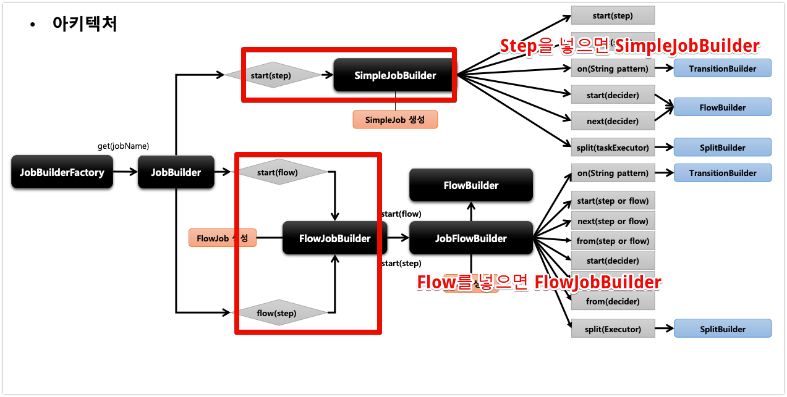
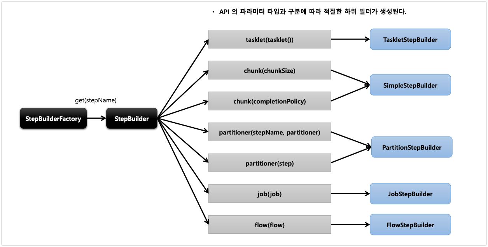
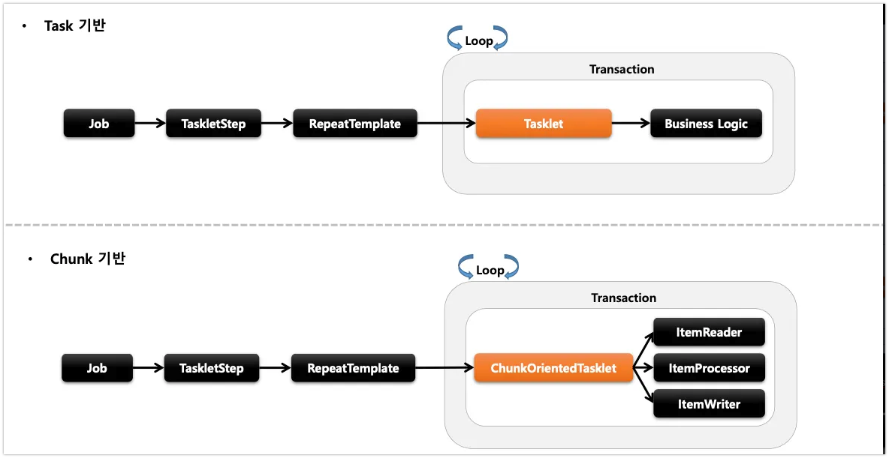
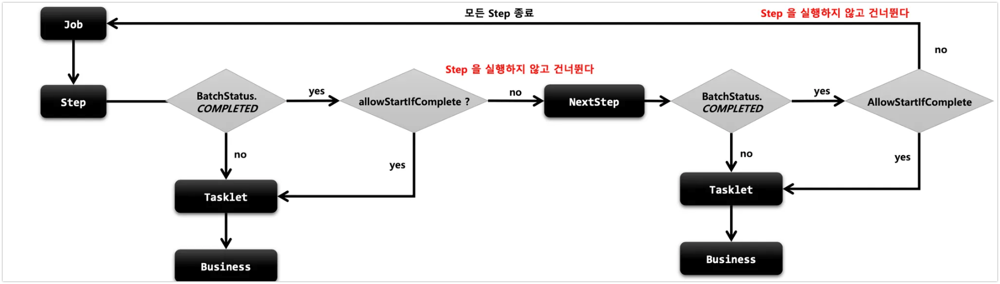
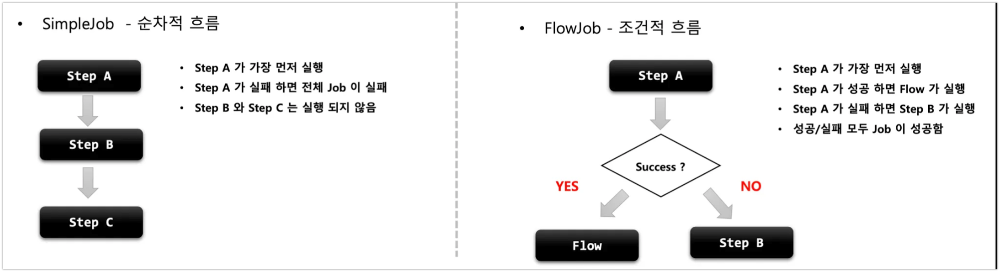
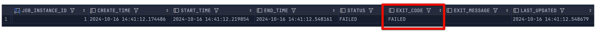

# Job

## JobBuilder
- JobBuilder는 Job을 생성하지 않고 실제 Job 생성을 위임한다.
  - SimpleJobBuilder
  - FlowJobBuilder



## SimpleJob
- SimpleJob은 SimpleJobBuilder에 의해서 생성되며 여러 단계의 Step을 가질 수 있고 순차적으로 Step을 실행을 시킨다.
- 모든 Step이 성공이 되어야지 Job이 성공된다.
- 맨 마지막에 처리된 Step의 BatchStatus가 Job의 Status가 된다.

```java
@Bean
public Job simpleStepJob() throws Exception {
    return new JobBuilder("simpleStepJob", jobRepository)
            .start(simpleStepExecutionStep())
            .next(simpleStepExecutionStep_2())
            .incrementer() // 잡 파라미터의 ID를 자동으로 증가시킨다.
            .preventRestart() // Job의 재시작 여부를 설정한다. 기본적으로 True
            .validator() // JobParameter를 실행하기 전에 올바른지 체크한다.
            .listener() // 콜백받아 리스너 처리를 한다.
            .build();
}
```

### preventRestart
- JobInstance가 같을 때 재시작을 막는다. 
- 기본적으로 true로 설정이 되어서 재시작이 가능하지만 해당 API를 추가를 하게 된다면 재시작이 불가능하다.

### 상황
1. step1,2가 있다고 가정하고 step2에서 exception이 발생했다.
2. preventRestart를 설정한다.
3. 이전에는 실패한 step2를 실행하지만 지금은 다음과 같은 exception이 발생한다.
```java
2024-10-16 10:51:09 [ERROR] [] [] Application run failed
java.lang.IllegalStateException: Failed to execute ApplicationRunner
at org.springframework.boot.SpringApplication.lambda$callRunner$6(SpringApplication.java:797)
at org.springframework.util.function.ThrowingConsumer.accept(ThrowingConsumer.java:66)
at org.springframework.util.function.ThrowingConsumer$1.accept(ThrowingConsumer.java:88)
at org.springframework.boot.SpringApplication.callRunner(SpringApplication.java:798)
at org.springframework.boot.SpringApplication.callRunner(SpringApplication.java:786)
at org.springframework.boot.SpringApplication.lambda$callRunners$3(SpringApplication.java:774)
at java.base/java.util.stream.ForEachOps$ForEachOp$OfRef.accept(ForEachOps.java:183)
```

### Validator
- Job 실행에 꼭 필요한 파라미터를 검증하는 용도
- `DefaultJobParametersValidator` 구현체를 지원하며 더 복잡한 제약조건이 있으면 직접 구현
- `reqiredKeys` : 반드시 필요한 key / `optionalKeys` : 옵션
-

```java
public class SimpleJob extends AbstractJob
private JobParametersValidator jobParametersValidator = new DefaultJobParametersValidator();

```

- 2번의 검증을 하게 된다.
    - SimpleJobLancher에서 검증SimpleJob의 상위 `AbstractJob`에서 검증

```java
@Component
class CustomJobParamValidator implements JobParametersValidator{

    @Override
    public void validate(JobParameters parameters) throws JobParametersInvalidException {
        if (parameters.getString("name") == null)
            throw new JobParametersInvalidException("name parameters is
    }
}
```

# Step

## StepBuilder
- Step을 구성하는 설정 조건에 맞게 하위 빌더 클래스를 생성하고 실제 Step을 위임하는 역활을 처리한다.

1. TaskletStepBuilder
- 이 빌더는 단순 Tasklet을 사용하는 Step을 생성합니다. 개발자가 직접 구현한 Tasklet 인터페이스의 구현체를 사용합니다. ChunkOrientedTasklet을 사용하지 않습니다.

2. SimpleStepBuilder
- 이 빌더는 Chunk 지향 처리를 위한 Step을 생성합니다. 내부적으로 ChunkOrientedTasklet을 생성하여 사용합니다. ItemReader, ItemProcessor, ItemWriter를 조합하여 Chunk 처리를 수행합니다.
3. PartitionStepBuilder : 멀티 스레드 방식으로 Job을 실행한다.
4. JobStepBuilder : JobStep을 생성하고 Step안에서 Job을 실행한다.
5. FlowStepBuilder : FlowStep을 생성하여 Step안에 Flow를 실행한다.

> 각각의 API 파라미터에 맞게 StepBuilder는 하위 빌더 클래스에게 Step 생성을 위임하는 것을 알 수 있다.



## [Tasklet, Chunk 그래서 머가 다른데?]

- 일단 API의 파라미터에 따라서 Step을 생성하는 빌더가 다르다. 

**TaskletStepBuilder**
- **TaskletStepBuilder**의 경우에는 단순히 Tasklet을 사용하여 단일 작업을 처리한다.
- 하나의 Tasklet은 하나의 트랜잭션에서 동작하며 단순한 작업에 적절하다.

**SimpleStepBuilder**
- SimpleStepBuilder은 chunkOrientedTasklet을 사용하여 Reader, Processor, Writer 작업을 수행한다.
- 하나의 덩어리를 n으로 나누어서 실행하는 의미 > 대량 처리를 하는 경우 효과적으로 설계가 가능하다.


## StartLimit

- Step의 실행 횟수를 조정할 수 있다.
- Step마다 설정할 수 있다.
- 설정 값을 초과해서 다시 실행하려고 하면 `StartLimitExceededException`
- start-limit의 디폴트 값은 Integer.MAX_VALUE

```java
@Configuration
@Component
public class Step4_2 {

    @Bean
    Job job(JobRepository jobRepository, Step step01, Step step02) {
        return new JobBuilder("step4_2", jobRepository)
                .start(step01)
                .next(step02)
                .build();
    }

    @Bean
    Step step01(JobRepository jobRepository, PlatformTransactionManager transactionManager) {
        return new StepBuilder("step1", jobRepository)
                .tasklet(new Tasklet() {
                    @Override
                    public RepeatStatus execute(StepContribution contribution, ChunkContext chunkContext) throws Exception {
                        System.out.println("Step 01 start =================");
                        return RepeatStatus.FINISHED;
                    }
                }, transactionManager)
                .build();
    }

    @Bean
    Step step02(JobRepository jobRepository, PlatformTransactionManager transactionManager) {
        return new StepBuilder("step2", jobRepository)
                .tasklet(new Tasklet() {
                    @Override
                    public RepeatStatus execute(StepContribution contribution, ChunkContext chunkContext) throws Exception {

                        System.out.println("Step02 Start ===================");
                        System.out.println("contribution = " + contribution);
                        System.out.println("chunkContext = " + chunkContext);
                        throw new RuntimeException("step2 exception");
                    }
                }, transactionManager)
                .startLimit(3)
                .build();
    }

}
```

- 처음에 실행하면 Step1, Step2가 실행, Step2에서 Exception이 발생한다.
    1.  **`BATCH_JOB_EXECUTION` 이 fail 1개 추가 , `BATCH_STEP_EXECUTION` 은 Step1 성공 Step2 실패 생성, fail ++**
    2.  **`BATCH_JOB_EXECUTION` 이 fail 1개 추가 , `BATCH_STEP_EXECUTION` 은  Step2 실패 생성 , fail ++**
    3.  **`BATCH_JOB_EXECUTION` 이 fail 1개 추가 , `BATCH_STEP_EXECUTION` 은  Step2 실패 생성, fail ++**
    4.  Step2가 실행되지 않고 **`BATCH_JOB_EXECUTION` 에**`StartLimitExceededException` 발생
    5. startLimit(3)으로 설정해서 **`BATCH_STEP_EXECUTION` 이 3초과하면 동작을 하지 않는다.**

### allowStartIfComplete()

- 재시작 가능한 job에서 Step의 이전에 성공 여부와 상관없이 항상 Step을 실행
- 실행 마다 유효성 검증을 하는 Step / tkwjs wkrdjq
- Completed 상태를 가진 Step은 Job 재시작시 실행하지 않고 스킵, allowstart를 true로 설정하면 항상 실행


```java
@Bean
Step step01(JobRepository jobRepository, PlatformTransactionManager transactionManager) {
    return new StepBuilder("step1", jobRepository)// StepBuilder를 생성하여 Step의 이름을 매개변수로 받는다.
            .tasklet(new Tasklet() {
                @Override
                public RepeatStatus execute(StepContribution contribution, ChunkContext chunkContext) throws Exception {
                    System.out.println("Step 01 start =================");
                    return RepeatStatus.FINISHED;
                }
            }, transactionManager)
            .allowStartIfComplete(true)
            .build();
}
```

 위에 코드를 기반으로 `allowStartIfComplete(true)` 를 처리하면 **`BATCH_STEP_EXECUTION` 은 성공한 Step1을 실행하지 않았다. 하지만 true로 설정하며 N번째 모두 Step1 이 실행된다.**
 
## Flow
- Step을 순차적으로만 구성하는 것이 아닌 특정한 상태에 따라 흐름을 전환하도록 구성할 수 있다.
    - Step이 실패를 하더라도  Job은 실패로 끝나지 않도록 해야 하는 경우
    - Step이 성공 했을 때 다음에 실행해야 할 Step을 구분해서 실행해야 하는 경우
    - 특정 Step은 전혀 실행되지 않게 구성 해야 하는 경우

- Flow, Job은 흐름을 구성하고 비즈니스 로직은 Step에서 이루어진다.
    - 내부적으로 SimpleFlow 객체를 가지고 있어  Job 실행 시 호출한다.
  



## FlowJob
```java
@Bean
public Job simpleJobExecution() throws Exception {
    return new JobBuilder("simpleJobExecution", jobRepository)
            .incrementer(new RunIdIncrementer())
            .start(simpleJobExecutionStep_1())
            .on(string Patten) // Step의 exitStatus를 매칭을 시켜서 to의 step으로 이동을 시킨다. 
            .to()
            .stop() / fail() / end()/ stopAndRestart() // Flow를 중지 / 실패 / 종료 하도록 Flow 종료
            .from() // 이전 단계에서 정의한 Step의 Flow를 추가적으로 정의함
            .end() // FlowBuilder를 종료하고 SimpleFlow 생성한다.
            .build();
}
```

### exam code
- 해당 코드는 flowStep1을 실행을 시켜서 Status에 따라서 다음 Step을 이동을 시키게 한다.
- start, next에 파라미터로 step, flow에 따라서 Step을 생성하는 Builder가 다르게 되고
  - step을 넣으면 SimpleFlowBuilder가 Flow를 넣으면 FlowBuilder가 생성되어 처리된다.

```java
@Slf4j
@Configuration
@RequiredArgsConstructor
public class FlowJobExam2 {
  private final JobRepository jobRepository;
  private final PlatformTransactionManager transactionManager;

  @Bean
  public Job simpleFlowExam2() throws Exception {
    return new JobBuilder("simpleFlowExam2", jobRepository)
            .incrementer(new RunIdIncrementer())
            .start(firstFlow1())
            .next((flowExamStep3()))
            .on("COMPLETED")
            .to(flowExamStep4())
            .on("COMPLETED")
            .to(flowExamStep5())
            .end()
            .build();
  }

  @Bean
  public Flow firstFlow1() {
    return new FlowBuilder<Flow>("firstFlow1")
            .start(flowExamStep1())
            .next(flowExamStep2())
            .build();
  }
  @Bean
  Step flowExamStep1() {
    return new StepBuilder("flowExamStep1", jobRepository)
            .tasklet((contribution, chunkContext) -> {
              log.info("===============step1 was excuted!===============");
              return RepeatStatus.FINISHED;
            }, transactionManager)
            .build();
  }

  @Bean
  Step flowExamStep2() {
    return new StepBuilder("flowExamStep2", jobRepository)
            .tasklet((contribution, chunkContext) -> {
              log.info("===============step2 was excuted!===============");
              return RepeatStatus.FINISHED;
            }, transactionManager)
            .build();
  }

  @Bean
  Step flowExamStep3() {
    return new StepBuilder("flowExamStep3", jobRepository)
            .tasklet((contribution, chunkContext) -> {
              log.info("===============step3 was excuted!===============");
              return RepeatStatus.FINISHED;
            }, transactionManager)
            .build();
  }

  @Bean
  Step flowExamStep4() {
    return new StepBuilder("flowExamStep4", jobRepository)
            .tasklet((contribution, chunkContext) -> {
              log.info("===============step4 was excuted!===============");
              return RepeatStatus.FINISHED;
            }, transactionManager)
            .build();
  }

  @Bean
  Step flowExamStep5() {
    return new StepBuilder("flowExamStep5", jobRepository)
            .tasklet((contribution, chunkContext) -> {
              log.info("===============step5 was excuted!===============");
              throw new RuntimeException("Step5 Exception Haha");
            }, transactionManager)
            .build();
  }
}


2024-10-16 14:41:12 [INFO ] [] [] Executing step: [flowExamStep1]
2024-10-16 14:41:12 [INFO ] [] [] ===============step1 was excuted!===============
2024-10-16 14:41:12 [INFO ] [] [] Step: [flowExamStep1] executed in 31ms
2024-10-16 14:41:12 [INFO ] [] [] Executing step: [flowExamStep2]
2024-10-16 14:41:12 [INFO ] [] [] ===============step2 was excuted!===============
2024-10-16 14:41:12 [INFO ] [] [] Step: [flowExamStep2] executed in 27ms
2024-10-16 14:41:12 [INFO ] [] [] Executing step: [flowExamStep3]
2024-10-16 14:41:12 [INFO ] [] [] ===============step3 was excuted!===============
2024-10-16 14:41:12 [INFO ] [] [] Step: [flowExamStep3] executed in 20ms
2024-10-16 14:41:12 [INFO ] [] [] Executing step: [flowExamStep4]
2024-10-16 14:41:12 [INFO ] [] [] ===============step4 was excuted!===============
2024-10-16 14:41:12 [INFO ] [] [] Step: [flowExamStep4] executed in 19ms
2024-10-16 14:41:12 [INFO ] [] [] Executing step: [flowExamStep5]
2024-10-16 14:41:12 [INFO ] [] [] ===============step5 was excuted!===============
2024-10-16 14:41:12 [ERROR] [] [] Encountered an error executing step flowExamStep5 in job simpleFlowExam2
java.lang.RuntimeException: Step5 Exception Haha
```
- 해당 쿼리를 살펴보면 flow의 (step1, step2)가 정상적으로 실행되고 이후 step3가 실행 > Complete가 되어 Step4 > Complete가 되어 Step5에서 exception이 발생을 확인할 수 있다.

> Flow를 처리를 하더라도 Job에는 실패 처리가 발생된다.



## FlowStep

